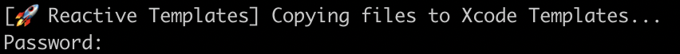
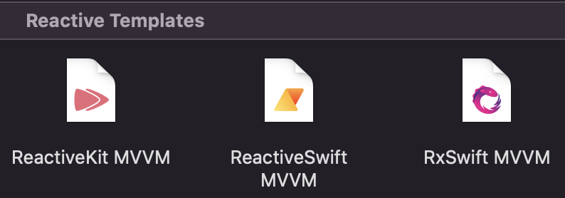

# 🚀 Reactive Templates

Reactive Templates – easiest way to create new MVVM modules without wasting time. It supports most popular reactive libraries including: RxSwift, ReactiveSwift and ReactiveKit.

## Installation
1. Download repository content
2. Unarchive project
3. Open your terminal and run script:
```bash
sh install.sh
```

4. Use templates in Xcode


## Uninstalling
If you want to remove Reactive Templates from your Xcode templates just run command:
```bash
sh uninstall.sh
```
